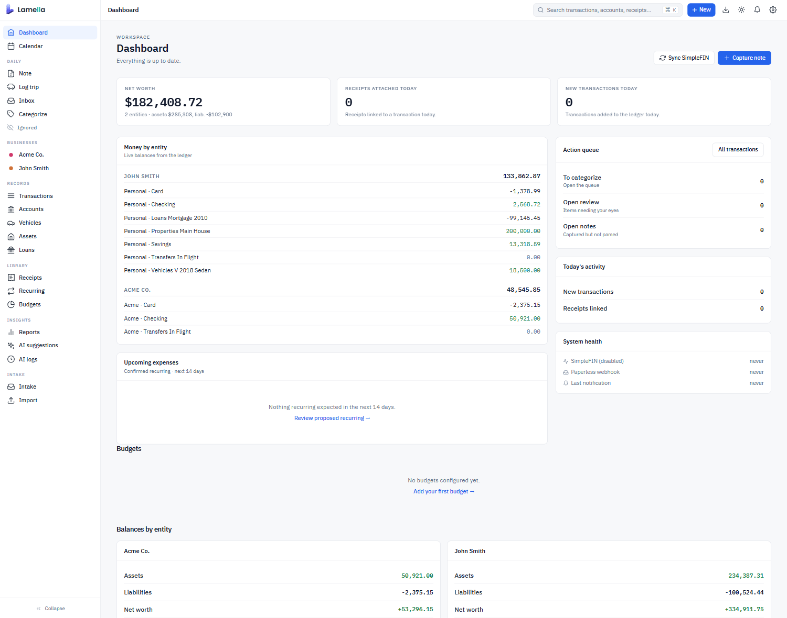
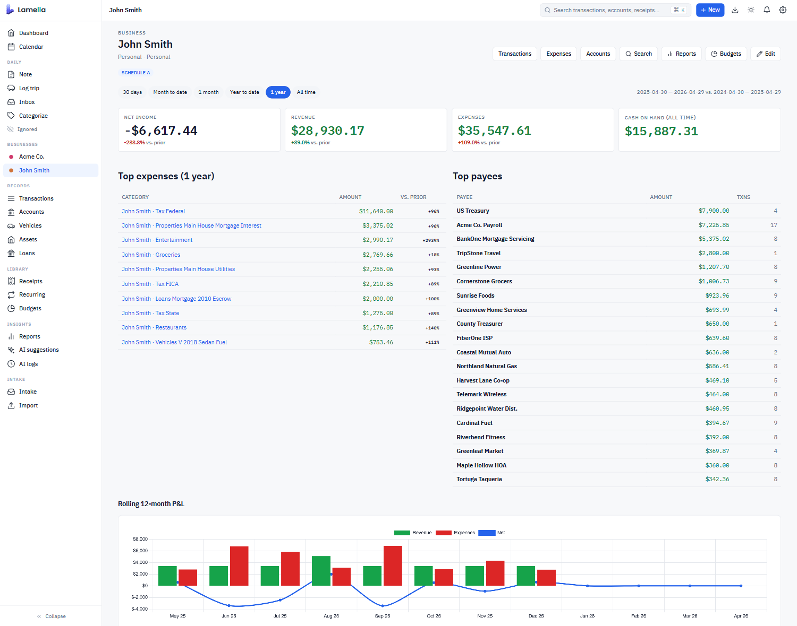
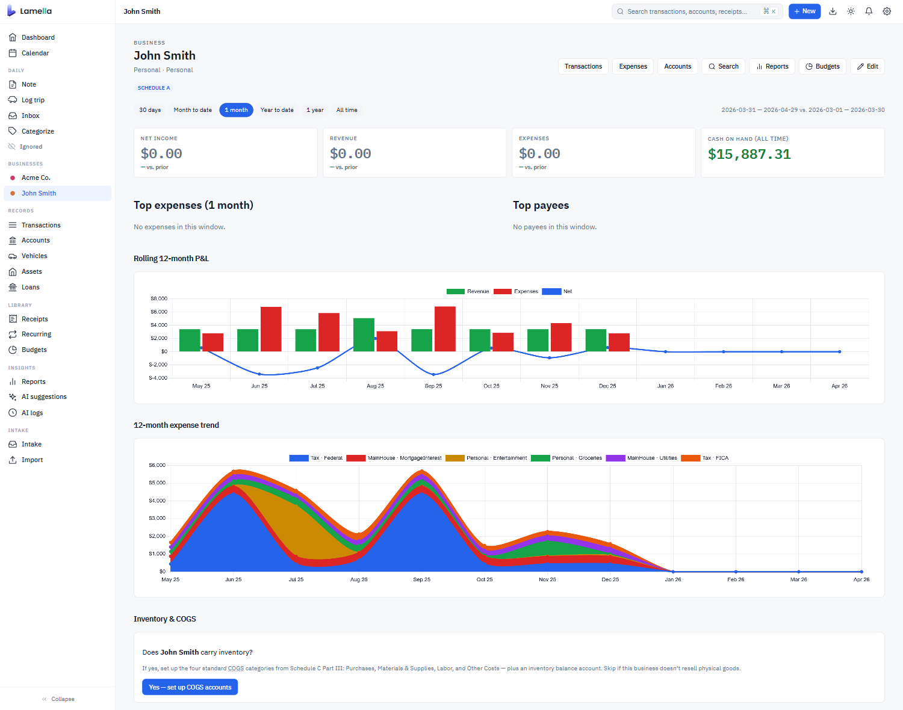
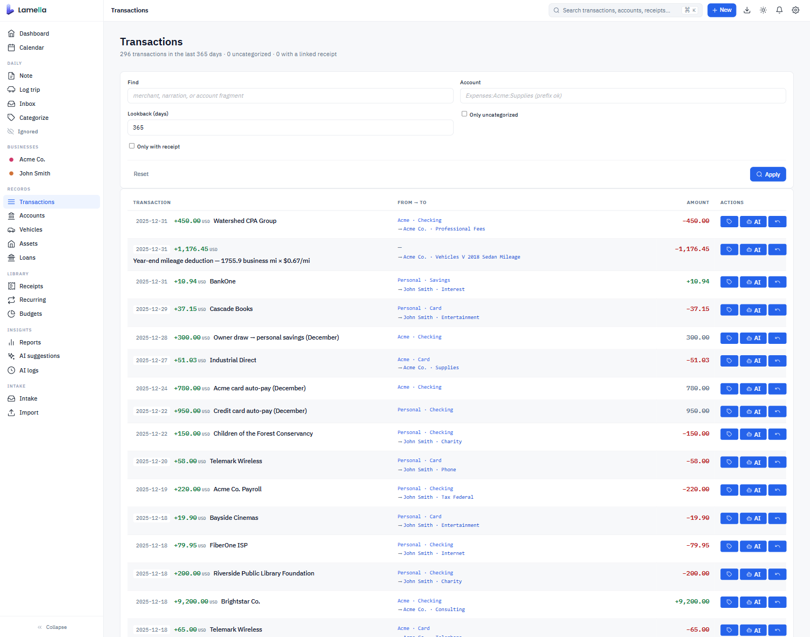
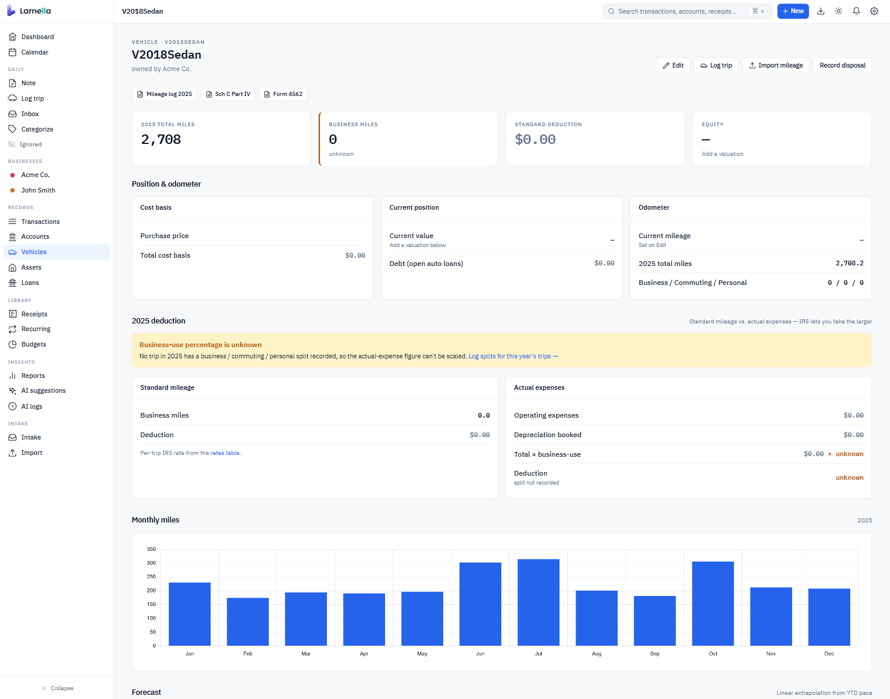

# Lamella

Lamella classifies your real-world financial activity into a trustworthy
Beancount ledger using AI plus context signals (receipts, projects, mileage, notes, card bindings) instead of brittle rules.

Self-hosted, single-user, single-container. Apache 2.0.
[lamella.ai](https://lamella.ai) ·
[github.com/lamella-ai/lamella](https://github.com/lamella-ai/lamella)

[](LICENSE)
[](https://github.com/lamella-ai/lamella/pkgs/container/lamella)
[](https://beancount.github.io/)
[](https://docs.paperless-ngx.com/)
[](https://openrouter.ai/)
[](https://github.com/lamella-ai/lamella/stargazers)
[](https://github.com/lamella-ai/lamella/commits/main)
[](https://github.com/lamella-ai/lamella/releases)
[](https://github.com/lamella-ai/lamella/releases)
[](https://github.com/lamella-ai/lamella/pkgs/container/lamella)

## Screenshots



| Personal entity | Business entity |
| :-- | :-- |
|  |  |

| Transactions | Vehicle deduction |
| :-- | :-- |
|  |  |

---

## Who this is for

- Operators with multiple entities, mixed personal/business cards, and
  receipts that arrive correctly labeled approximately never.
- People who already use Beancount (or want to) and want classification
  to be a function of *context*, not a giant pile of regex rules.
- Self-hosters who'd rather run one container behind a tunnel than send
  their books to a SaaS.

## Who this is not for

- Anyone wanting a hosted SaaS. Lamella is self-hosted only.
- Anyone who needs their financial data on someone else's servers.
  Lamella keeps Beancount files on disk that you own; the UI is the
  primary surface, but everything is plaintext and yours.
- Teams of accountants. One operator, one ledger, one container.

---

## Quick start

```bash
mkdir -p ~/lamella/{data,ledger}
cd ~/lamella
curl -fsSL https://raw.githubusercontent.com/lamella-ai/lamella/main/docker-compose.yml -o docker-compose.yml
curl -fsSL https://raw.githubusercontent.com/lamella-ai/lamella/main/.env.example -o .env

# Edit .env. At minimum set:
#   AUTH_USERNAME=you
#   AUTH_PASSWORD=somethingLong

docker compose up -d
```

Then open `http://localhost:8080` and sign in. The plaintext password is
hashed with Argon2id on first read and the env var is then ignored;
change it from `/account/password` afterwards. Pre-hash with
`AUTH_PASSWORD_HASH` if you'd rather not put plaintext in `.env`.

The container binds to `127.0.0.1` by default for non-Docker runs. If
you bind to a public interface without auth, the app refuses to launch
with a loud banner. Cloudflare Zero Trust, Tailscale, or nginx basic
auth in front remains the right answer for any internet-facing
deployment.

**Volume layout** (matches the compose file):

- `./data`: SQLite DB + nightly backups (`./data/backups/`).
- `./ledger`: your Beancount ledger root. Drop a `main.bean` here
  before first run, or let the in-app setup wizard write one for you.

See [docs/quickstart.md](docs/quickstart.md) for a longer walkthrough,
[docs/configuration.md](docs/configuration.md) for the full env-var
matrix, and [docs/troubleshooting.md](docs/troubleshooting.md) when
something doesn't come up.

**Building from source** (contributors): `git clone`, `pip install -e .[dev]`,
`uvicorn lamella.main:app --reload`, `pytest`. Full notes in
[CONTRIBUTING.md](CONTRIBUTING.md).

---

## What this system is

Beancount is the ledger. Everything else in this repository (Lamella)
is the system that makes the ledger **trustworthy** without requiring
you to live inside it.

Standard bookkeeping tools assume a clean world: one business, one
card, one purpose per transaction, data that arrives correctly labeled
and ready to file. That world doesn't exist for most real operators.

The real world looks like this:

- A charge lands on the wrong card because three cards look identical
  in your wallet.
- A hardware-store receipt could be inventory, office supplies,
  equipment, or home improvement, depending on what was actually
  bought.
- A fuel-station charge could be personal vehicle fuel, equipment
  fuel, or a business vehicle, depending on which vehicle you used
  that day.
- A payment processor sends money in and the bank has no idea if
  it's a sale, a refund, a transfer, or a reimbursement.
- You start one construction project in July, kick off another in
  September, and buy materials that could belong to either.
- Your tax preparer appears once a year and the system has no memory
  of how you categorized them last time.

Every one of these situations produces either a wrong classification,
a FIXME placeholder, or a one-sided transaction that makes the books
technically balance but financially meaningless. Multiply that by
30,000 transactions across four years and several entities and you
have books that pass `bean-check` but can't produce a trustworthy
Schedule C.

This system's job is to fix that by assembling **every available
context signal** about each transaction and giving the full picture
to an AI classifier that can reason about all of it at once.

---

## What it produces

- **Correct double-entry books.** Transfers between your own accounts
  are single balanced transactions, not two one-sided entries.
  Intercompany charges create proper receivables and payables. A
  payment-processor → bank transfer is one event, not a mysterious
  inflow and a mysterious outflow.
- **Progressively smarter classification.** Every human correction is
  a training signal. The vector index grows; the merchant histogram
  fills in; entity and account descriptions get refined. A new
  merchant the system struggles with today gets handled correctly
  six months from now because something similar got corrected in
  between.
- **Trustworthy Schedule C / F output** per entity. Intercompany
  balances are accounted for. Deductibility edge cases (a structural
  improvement with partial business purpose, a multi-site construction
  project, a trade-show meal) have been reasoned about with full
  project and travel context instead of guessed at.
- **Paperless as a living document store.** Documents get enriched
  with what the system learned: the vehicle that filled up at
  Warehouse Club, the project the Hardware Store lumber belongs to,
  the business meeting the restaurant receipt was for. Document
  store and ledger reinforce each other.

---

## Philosophy

### Context determines classification, not rules

A transaction is not classifiable in isolation. "Restaurant, $54.72"
means something completely different depending on which card was
used, whether you were traveling for business that day, what note
you wrote that morning, whether there's a receipt showing it was a
business meeting, and what entity you were working for. The same
charge can be a personal meal, a deductible business meal with a
client, or a travel-meal expense.

Rules exist, but they are **signals, not commands**. A rule that
says "Restaurant → Personal:Meals" tells the AI "historically this
has been a personal meal 87% of the time." It does not override the
AI's judgment when an active note shows you're out of town for a
trade show and the receipt shows a business lunch.

### The ledger is sacred; everything else is a scratchpad

Beancount files are the source of truth. They're backed up
aggressively, versioned, human-readable, and the system can always
reconstruct its working state from them.

The SQLite database exists to hold things in flight: transactions
being processed, rules being learned, embeddings being cached, audit
decisions pending review. **If the database is deleted, the system
rebuilds from the ledger and re-fetches from data sources.** Nothing
that matters is lost.

### Non-destructive by default

Every operation that touches the ledger snapshots the file first,
proposes output separately, and requires explicit user approval
before anything overwrites the real thing. `bean-check` runs after
every write with a baseline-subtraction tolerance (pre-existing
ledger errors don't cause a revert; only *new* errors do). The
system is designed so it cannot silently corrupt the books.

---

## The context stack

Every classification draws on a layered stack of signals. These are
not independent features. They are one unified input to a single AI
decision.

1. **Card binding.** The strongest default signal. The data tells
   you which card was charged; that part is certain. But the card
   tells you who *paid*, not necessarily who *should have paid*.
   Wrong-card situations happen regularly (three cards in one wallet
   look identical), so the card is treated as a starting hypothesis
   that can be overridden by notes, merchant histograms, projects,
   or AI intercompany flags. See `CLAUDE.md` for the full
   intercompany mechanics.
2. **Entity descriptions.** Plain-English paragraphs per entity:
   what the business does, who it sells to, what it typically spends
   money on. Written once, rendered into the classify prompt for
   every txn on that entity's cards as strong background.
3. **Account descriptions.** Per-account plain-English context
   ("This account is for Stamps.com postage labels and USPS shipping
   costs for Acme fulfillment"). New, narrow accounts become
   immediately classifiable without transaction history.
4. **Vector-similar transaction history.** Semantic search over the
   full resolved transaction corpus. Not substring matching, but
   sentence-transformer embeddings so "Restaurant #1288" finds
   a related "Restaurant #4521" entry from three years ago. User
   corrections are weighted **2×** over the original ledger entry
   so the classifier learns from disagreements.
5. **Active notes.** Contemporaneous context you write in the
   moment: "just grabbed supplies for the shop." Scoped to a date
   range, optionally to a card or entity. Notes can explicitly
   override card binding when you say so ("using wrong card this
   week").
6. **Projects.** Structured, multi-day context windows with an
   owning entity, date range, budget, expected-merchants list, and
   a description that gets rendered into the classify prompt on
   every matching transaction. Multiple projects can be active
   simultaneously; overlap ambiguity triggers lower confidence
   instead of silent guessing.
7. **Mileage logs.** Vehicle and trip records that corroborate
   other signals. A trip log entry naming the project site and a
   hardware store, dated near a hardware-store charge during an
   active project at that site, is corroborating evidence, not
   coincidence.
8. **Receipts via Paperless-ngx.** Actual document content
   including OCR'd line items. What makes "Hardware Store →
   which category" answerable. Lumber and concrete means something
   different than printer paper and ink. OCR errors get corrected
   by sending the original image back to a vision AI, which
   verifies independently against the image and writes corrections
   back to Paperless tagged `Lamella Fixed`.
9. **Merchant frequency histogram.** Cross-entity pattern tracking.
   A merchant that has appeared 40 times on Acme cards and zero
   times on WidgetCo cards is suspicious when it appears on a WidgetCo
   card, and the system flags rather than silently classifies.
10. **Intercompany awareness.** When the wrong card is used (card
    says Entity A, evidence says Entity B), the review queue
    generates the proper four-leg accounting entry: Entity A's card
    paid Entity B's expense, Entity B owes Entity A, and the
    receivable/payable exists on both sides of the books.

Every piece of the architecture (from the `/audit` page surfacing
AI disagreements, to the `/projects` page, to the `paperless/verify`
flow) serves either **adding a new context signal**, **improving
the accuracy of an existing one**, **making the ledger more
correct**, or **making the system more auditable**. If a proposed
feature doesn't do any of those, it probably doesn't belong.

---

## First-run walkthrough

1. **Stand up the container** (see Quick start above) and sign in.
2. Go to `/setup/check` and resolve every red issue. The page
   validates entities, accounts, vehicles, properties, loans,
   Paperless field mappings, and classification rules against the
   live ledger. Don't classify anything until this is green.
3. Go to `/status` and verify every card is green or yellow. This
   dashboard shows ledger count, AI cascade cost, vector index
   freshness, Paperless sync state, SimpleFIN mode, review queue
   depth, mileage entries, rules, and notifications: one page for
   "is my system actually working."
4. **Write entity contexts.** On `/settings/entities`, expand the
   "Classify context" panel on each active entity and write a
   paragraph describing what it does. Use the **Generate draft**
   button to auto-propose one from history, then edit.
5. **Write account descriptions** on `/settings/account-descriptions`,
   especially for narrow or new accounts. The AI draft button works
   here too; the Mine button proposes sub-categories for sprawling
   catchall accounts.
6. **Run the classification audit** at `/audit` with a small random
   sample first. Each Accept is a user-correction that the vector
   index will weight 2× going forward.
7. For each receipt with bad OCR, go to `/receipts`, expand
   "Verify / enrich via AI" on the linked row, and run verify. The
   vision AI re-extracts against the image and writes corrections
   back to Paperless with a `Lamella Fixed` tag.

The review queue itself lives at `/inbox`.

---

## Configuration

The full env-var matrix lives in [docs/configuration.md](docs/configuration.md).
The minimum to get going:

| Name | Default | Purpose |
| --- | --- | --- |
| `AUTH_USERNAME` | *(unset)* | Bootstrap username (set on first run, then ignored). |
| `AUTH_PASSWORD` | *(unset)* | Bootstrap password (Argon2id-hashed on first read). |
| `AUTH_PASSWORD_HASH` | *(unset)* | Pre-hashed alternative to `AUTH_PASSWORD`. |
| `LAMELLA_DATA_DIR` | `/data` | SQLite + backups. |
| `LEDGER_DIR` | `/ledger` | Beancount ledger root (bind-mounted). |
| `PORT` | `8080` | HTTP port. |
| `LOG_LEVEL` | `INFO` | Python logging level. |

### AI (OpenRouter)

| Name | Default | Purpose |
| --- | --- | --- |
| `OPENROUTER_API_KEY` | *(unset)* | Required to enable AI classify. |
| `OPENROUTER_MODEL` | `anthropic/claude-haiku-4.5` | Primary classify model. |
| `OPENROUTER_MODEL_FALLBACK` | `anthropic/claude-opus-4.7` | Fallback when primary returns low confidence. |
| `AI_FALLBACK_CONFIDENCE_THRESHOLD` | `0.60` | Threshold below which the fallback fires. |
| `AI_MAX_MONTHLY_SPEND_USD` | `0` | Hard cap; `0` = unlimited. |
| `OPENROUTER_MODEL_RECEIPT_VERIFY` | `anthropic/claude-opus-4.7` | Vision model for Paperless verify. |

Everything here is also editable at runtime from `/settings`.

### Paperless-ngx

| Name | Default | Purpose |
| --- | --- | --- |
| `PAPERLESS_URL` | *(unset)* | Paperless-ngx base URL. |
| `PAPERLESS_API_TOKEN` | *(unset)* | Paperless-ngx API token. |
| `PAPERLESS_WRITEBACK_ENABLED` | `0` | Enable correction writeback. |

### SimpleFIN

| Name | Default | Purpose |
| --- | --- | --- |
| `SIMPLEFIN_ACCESS_URL` | *(unset)* | Bridge URL, including `user:pass@`. Also editable on `/simplefin`. |
| `SIMPLEFIN_MODE` | `disabled` | `disabled` / `shadow` / `active`. |
| `SIMPLEFIN_FETCH_INTERVAL_HOURS` | `6` | Scheduled fetch interval. |
| `SIMPLEFIN_LOOKBACK_DAYS` | `14` | Window requested from the bridge. |
| `SIMPLEFIN_ACCOUNT_MAP_PATH` | `${LEDGER_DIR}/simplefin_account_map.yml` | SimpleFIN account id → Beancount source account. |

Copy `simplefin_account_map.yml.example` to the ledger dir and fill
in your accounts before flipping the mode out of `disabled`.

All integrations are optional. The app runs without Paperless or
OpenRouter; AI-assisted classification, receipt linking, and
Paperless writeback are inert until their respective keys are set.

### Volumes

- `/data`: SQLite database + backups.
- `/ledger`: the ledger. The container expects `main.bean` at the
  root. On first write, connector-owned files get appended to the
  `main.bean` include list; every other ledger file is read-only.

### Transform CLIs

One-shot migrations over connector-owned files. Dry-run by default;
`--apply` writes; every apply snapshots files and rolls back on
bean-check regression.

- `python -m lamella.transform.backfill_hash [--apply]`: stamp
  content hashes on existing receipt links.
- `python -m lamella.transform.migrate_to_ledger [--apply]`:
  one-shot: stamp SQLite state rows (budgets, rules, dismissals,
  etc.) into the matching ledger directives.
- `python -m lamella.transform.reconstruct [--force]`: rebuild
  SQLite state from the ledger alone.
- `python -m lamella.transform.verify`: diff live SQLite against a
  reconstructed copy; exits non-zero on untolerated drift.

---

## Status & limitations

Lamella is in active development by a single operator using it on
their own books. Things to know up front:

- **Single-operator deployment.** One ledger, one container, one
  user. The auth layer has roles for future multi-user setups, but
  the supported deployment shape is single-operator.
- **Test suite has a baseline of pre-existing failures** that
  reflect rapid-iteration coupling between fixtures and code.
  `pytest` will be red on a fresh clone; the practical contract
  during this phase is `pytest -k <suite>` for the area you are
  touching. Triage notes live in
  [docs/internal/pytest-baseline.md](docs/internal/pytest-baseline.md)
  if you want the breakdown.
- **Migrations are forward-only** and have been exercised against
  one real ledger, not a fleet. Snapshot before running them in
  anger.
- **Receipts, AI cascade, and SimpleFIN integrations are gated**
  behind configuration; the product can be operated with any one of
  them off.

Architectural decisions are captured as ADRs in `docs/adr/` (54 at
time of writing). Read those before assuming anything about the
design.

---

## Documentation map

- [CHANGELOG.md](CHANGELOG.md): release history.
- [CLAUDE.md](CLAUDE.md): routing layer for AI assistants working
  in this repo.
- [docs/core/PROJECT_CHARTER.md](docs/core/PROJECT_CHARTER.md): what
  Lamella is and isn't.
- [docs/core/SUCCESS_CRITERIA.md](docs/core/SUCCESS_CRITERIA.md): how
  we know it's working.
- [docs/adr/](docs/adr/): 51 architectural decision records. Start
  with `index.md`.
- [docs/features/](docs/features/): current state of every feature,
  derived from code.
- [docs/specs/](docs/specs/): load-bearing specs (ledger layout,
  txn identity, AI classification, recovery system).
- [docs/quickstart.md](docs/quickstart.md): longer-form first-run
  walkthrough.
- [docs/configuration.md](docs/configuration.md): full env-var matrix.
- [docs/troubleshooting.md](docs/troubleshooting.md): when it doesn't
  come up.

---

## License

Lamella is licensed under the Apache License, Version 2.0. See
[LICENSE](LICENSE) and [NOTICE](NOTICE) for the full terms, including
notice/attribution requirements, modification disclosures, and the
no-warranty clause.

## Trademark

"Lamella"™ and the Lamella logo are trademarks of Lamella LLC. The Apache
License does not grant rights to use these trademarks. If you fork
Lamella or build a derivative product, please choose a different name.
See [TRADEMARK.md](TRADEMARK.md) for the full trademark policy.

## Attribution

If you host Lamella as a service or include it in a product, a
"Powered by Lamella" credit linking to <https://lamella.ai> in your
footer is appreciated but not required.
