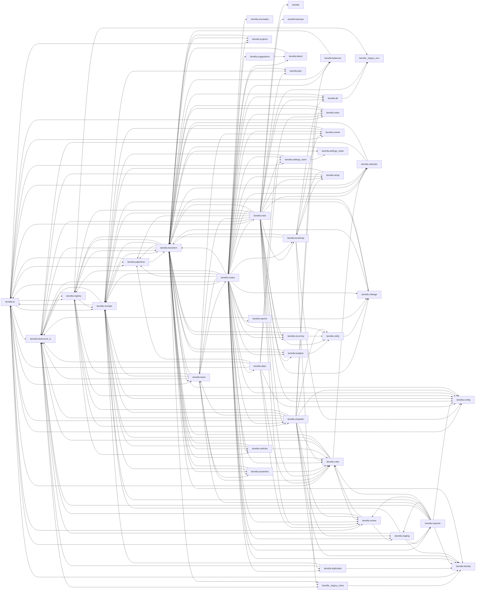

# Architecture snapshot (2026-04)

**Repo state:** `4d201bb` (snapshot date 2026-04-26)

## Health check

- **Subpackages:** 43
- **Cross-package edges:** 206
- **Total import sites:** 1103
- **Cyclic SCCs:** 1 (sizes: [34])

### Cyclic strongly-connected components

_Each SCC is a set of subpackages that mutually depend on each other (directly or transitively). A package graph with one big SCC means the codebase is a single tangled mass; many small SCCs mean targeted cycles._

- **SCC #1** (34 members): `lamella.ai`, `lamella.balances`, `lamella.beancount_io`, `lamella.bootstrap`, `lamella.budgets`, `lamella.calendar`, `lamella.deps`, `lamella.detect`, `lamella.duplicates`, `lamella.importer`, `lamella.loans`, `lamella.main`, `lamella.mileage`, `lamella.notes`, `lamella.notify`, `lamella.paperless`, `lamella.projects`, `lamella.properties`, `lamella.receipts`, `lamella.recurring`, `lamella.registry`, `lamella.reports`, `lamella.review`, `lamella.rewrite`, `lamella.routes`, `lamella.rules`, `lamella.settings_store`, `lamella.settings_writer`, `lamella.setup`, `lamella.simplefin`, `lamella.staging`, `lamella.suggestions`, `lamella.transform`, `lamella.vehicles`

## Module graph (Mermaid)

## Edge list

| From | To | Weight | Δ vs prev |
|---|---|---|---|
| `lamella.routes` | `lamella.registry` | 110 | _new_ |
| `lamella.routes` | `lamella.beancount_io` | 83 | _new_ |
| `lamella.routes` | `lamella.receipts` | 58 | _new_ |
| `lamella.routes` | `lamella.deps` | 56 | _new_ |
| `lamella.routes` | `lamella.config` | 51 | _new_ |
| `lamella.routes` | `lamella.ai` | 35 | _new_ |
| `lamella.routes` | `lamella.rules` | 34 | _new_ |
| `lamella.routes` | `lamella.setup` | 31 | _new_ |
| `lamella.routes` | `lamella.loans` | 24 | _new_ |
| `lamella.routes` | `lamella.paperless` | 22 | _new_ |
| `lamella.routes` | `lamella.bootstrap` | 21 | _new_ |
| `lamella.routes` | `lamella.review` | 16 | _new_ |
| `lamella.routes` | `lamella.simplefin` | 16 | _new_ |
| `lamella.routes` | `lamella.vehicles` | 16 | _new_ |
| `lamella.routes` | `lamella.staging` | 15 | _new_ |
| `lamella.receipts` | `lamella.paperless` | 11 | _new_ |
| `lamella.ai` | `lamella.beancount_io` | 10 | _new_ |
| `lamella.routes` | `lamella.reports` | 10 | _new_ |
| `lamella.routes` | `lamella.transform` | 10 | _new_ |
| `lamella.simplefin` | `lamella.ai` | 10 | _new_ |
| `lamella.transform` | `lamella.config` | 10 | _new_ |
| `lamella.routes` | `lamella.rewrite` | 9 | _new_ |
| `lamella.routes` | `lamella.settings_store` | 9 | _new_ |
| `lamella.transform` | `lamella.vehicles` | 9 | _new_ |
| `lamella.ai` | `lamella.rules` | 8 | _new_ |
| `lamella.main` | `lamella.registry` | 8 | _new_ |
| `lamella.loans` | `lamella.beancount_io` | 7 | _new_ |
| `lamella.routes` | `lamella.budgets` | 7 | _new_ |
| `lamella.transform` | `lamella.receipts` | 7 | _new_ |
| `lamella.bootstrap` | `lamella.config` | 6 | _new_ |
| `lamella.bootstrap` | `lamella.registry` | 6 | _new_ |
| `lamella.loans` | `lamella.receipts` | 6 | _new_ |
| `lamella.receipts` | `lamella.beancount_io` | 6 | _new_ |
| `lamella.registry` | `lamella.receipts` | 6 | _new_ |
| `lamella.routes` | `lamella.identity` | 6 | _new_ |
| `lamella.routes` | `lamella.notes` | 6 | _new_ |
| `lamella.routes` | `lamella.properties` | 6 | _new_ |
| `lamella.transform` | `lamella.beancount_io` | 6 | _new_ |
| `lamella.ai` | `lamella.loans` | 5 | _new_ |
| `lamella.bootstrap` | `lamella.setup` | 5 | _new_ |
| `lamella.importer` | `lamella.ai` | 5 | _new_ |
| `lamella.main` | `lamella.simplefin` | 5 | _new_ |
| `lamella.routes` | `lamella.balances` | 5 | _new_ |
| `lamella.routes` | `lamella.calendar` | 5 | _new_ |
| `lamella.routes` | `lamella.duplicates` | 5 | _new_ |
| `lamella.routes` | `lamella.importer` | 5 | _new_ |
| `lamella.routes` | `lamella.mileage` | 5 | _new_ |
| `lamella.routes` | `lamella.recurring` | 5 | _new_ |
| `lamella.simplefin` | `lamella.rules` | 5 | _new_ |
| `lamella.transform` | `lamella.db` | 5 | _new_ |
| `lamella.transform` | `lamella.paperless` | 5 | _new_ |
| `lamella.transform` | `lamella.registry` | 5 | _new_ |
| `lamella.bootstrap` | `lamella.transform` | 4 | _new_ |
| `lamella.calendar` | `lamella.ai` | 4 | _new_ |
| `lamella.importer` | `lamella.rules` | 4 | _new_ |
| `lamella.importer` | `lamella.staging` | 4 | _new_ |
| `lamella.loans` | `lamella.registry` | 4 | _new_ |
| `lamella.loans` | `lamella.routes` | 4 | _new_ |
| `lamella.main` | `lamella.ai` | 4 | _new_ |
| `lamella.main` | `lamella.bootstrap` | 4 | _new_ |
| `lamella.main` | `lamella.loans` | 4 | _new_ |
| `lamella.main` | `lamella.notify` | 4 | _new_ |
| `lamella.registry` | `lamella.transform` | 4 | _new_ |
| `lamella.routes` | `lamella.main` | 4 | _new_ |
| `lamella.simplefin` | `lamella.loans` | 4 | _new_ |
| `lamella.transform` | `lamella.loans` | 4 | _new_ |
| `lamella.ai` | `lamella.config` | 3 | _new_ |
| `lamella.ai` | `lamella.paperless` | 3 | _new_ |
| `lamella.bootstrap` | `lamella._legacy_meta` | 3 | _new_ |
| `lamella.bootstrap` | `lamella.db` | 3 | _new_ |
| `lamella.deps` | `lamella.rules` | 3 | _new_ |
| `lamella.loans` | `lamella.rules` | 3 | _new_ |
| `lamella.main` | `lamella.rules` | 3 | _new_ |
| `lamella.registry` | `lamella.beancount_io` | 3 | _new_ |
| `lamella.routes` | `lamella.db` | 3 | _new_ |
| `lamella.routes` | `lamella.notify` | 3 | _new_ |
| `lamella.routes` | `lamella.projects` | 3 | _new_ |
| `lamella.routes` | `lamella.suggestions` | 3 | _new_ |
| `lamella.staging` | `lamella.beancount_io` | 3 | _new_ |
| `lamella.staging` | `lamella.receipts` | 3 | _new_ |
| `lamella.transform` | `lamella.calendar` | 3 | _new_ |
| `lamella.transform` | `lamella.settings_writer` | 3 | _new_ |
| `lamella.vehicles` | `lamella.transform` | 3 | _new_ |
| `lamella.ai` | `lamella.identity` | 2 | _new_ |
| `lamella.ai` | `lamella.receipts` | 2 | _new_ |
| `lamella.ai` | `lamella.registry` | 2 | _new_ |
| `lamella.ai` | `lamella.rewrite` | 2 | _new_ |
| `lamella.balances` | `lamella.transform` | 2 | _new_ |
| `lamella.budgets` | `lamella.notify` | 2 | _new_ |
| `lamella.calendar` | `lamella.beancount_io` | 2 | _new_ |
| `lamella.importer` | `lamella.beancount_io` | 2 | _new_ |
| `lamella.importer` | `lamella.receipts` | 2 | _new_ |
| `lamella.loans` | `lamella.transform` | 2 | _new_ |
| `lamella.main` | `lamella.calendar` | 2 | _new_ |
| `lamella.main` | `lamella.mileage` | 2 | _new_ |
| `lamella.main` | `lamella.paperless` | 2 | _new_ |
| `lamella.main` | `lamella.recurring` | 2 | _new_ |
| `lamella.projects` | `lamella.transform` | 2 | _new_ |
| `lamella.properties` | `lamella.transform` | 2 | _new_ |
| `lamella.receipts` | `lamella.config` | 2 | _new_ |
| `lamella.recurring` | `lamella.notify` | 2 | _new_ |
| `lamella.registry` | `lamella.config` | 2 | _new_ |
| `lamella.routes` | `lamella.jobs` | 2 | _new_ |
| `lamella.settings_store` | `lamella.receipts` | 2 | _new_ |
| `lamella.settings_store` | `lamella.settings_writer` | 2 | _new_ |
| `lamella.simplefin` | `lamella.balances` | 2 | _new_ |
| `lamella.simplefin` | `lamella.identity` | 2 | _new_ |
| `lamella.simplefin` | `lamella.notify` | 2 | _new_ |
| `lamella.simplefin` | `lamella.receipts` | 2 | _new_ |
| `lamella.simplefin` | `lamella.review` | 2 | _new_ |
| `lamella.simplefin` | `lamella.staging` | 2 | _new_ |
| `lamella.staging` | `lamella.importer` | 2 | _new_ |
| `lamella.transform` | `lamella.balances` | 2 | _new_ |
| `lamella.transform` | `lamella.budgets` | 2 | _new_ |
| `lamella.transform` | `lamella.mileage` | 2 | _new_ |
| `lamella.transform` | `lamella.projects` | 2 | _new_ |
| `lamella.transform` | `lamella.properties` | 2 | _new_ |
| `lamella.transform` | `lamella.recurring` | 2 | _new_ |
| `lamella.transform` | `lamella.rules` | 2 | _new_ |
| `lamella._legacy_meta` | `lamella.identity` | 1 | _new_ |
| `lamella.ai` | `lamella.notes` | 1 | _new_ |
| `lamella.ai` | `lamella.projects` | 1 | _new_ |
| `lamella.ai` | `lamella.review` | 1 | _new_ |
| `lamella.ai` | `lamella.settings_store` | 1 | _new_ |
| `lamella.beancount_io` | `lamella._legacy_meta` | 1 | _new_ |
| `lamella.beancount_io` | `lamella.registry` | 1 | _new_ |
| `lamella.bootstrap` | `lamella.rewrite` | 1 | _new_ |
| `lamella.budgets` | `lamella.transform` | 1 | _new_ |
| `lamella.calendar` | `lamella.transform` | 1 | _new_ |
| `lamella.db` | `lamella._legacy_env` | 1 | _new_ |
| `lamella.deps` | `lamella.ai` | 1 | _new_ |
| `lamella.deps` | `lamella.beancount_io` | 1 | _new_ |
| `lamella.deps` | `lamella.config` | 1 | _new_ |
| `lamella.deps` | `lamella.notes` | 1 | _new_ |
| `lamella.deps` | `lamella.paperless` | 1 | _new_ |
| `lamella.deps` | `lamella.review` | 1 | _new_ |
| `lamella.deps` | `lamella.settings_store` | 1 | _new_ |
| `lamella.detect` | `lamella.transform` | 1 | _new_ |
| `lamella.duplicates` | `lamella.beancount_io` | 1 | _new_ |
| `lamella.duplicates` | `lamella.identity` | 1 | _new_ |
| `lamella.duplicates` | `lamella.receipts` | 1 | _new_ |
| `lamella.importer` | `lamella.config` | 1 | _new_ |
| `lamella.importer` | `lamella.identity` | 1 | _new_ |
| `lamella.importer` | `lamella.loans` | 1 | _new_ |
| `lamella.importer` | `lamella.review` | 1 | _new_ |
| `lamella.loans` | `lamella.properties` | 1 | _new_ |
| `lamella.loans` | `lamella.rewrite` | 1 | _new_ |
| `lamella.main` | `lamella` | 1 | _new_ |
| `lamella.main` | `lamella._legacy_env` | 1 | _new_ |
| `lamella.main` | `lamella.backups` | 1 | _new_ |
| `lamella.main` | `lamella.beancount_io` | 1 | _new_ |
| `lamella.main` | `lamella.budgets` | 1 | _new_ |
| `lamella.main` | `lamella.config` | 1 | _new_ |
| `lamella.main` | `lamella.db` | 1 | _new_ |
| `lamella.main` | `lamella.jobs` | 1 | _new_ |
| `lamella.main` | `lamella.receipts` | 1 | _new_ |
| `lamella.main` | `lamella.review` | 1 | _new_ |
| `lamella.main` | `lamella.routes` | 1 | _new_ |
| `lamella.main` | `lamella.settings_store` | 1 | _new_ |
| `lamella.main` | `lamella.setup` | 1 | _new_ |
| `lamella.main` | `lamella.transform` | 1 | _new_ |
| `lamella.mileage` | `lamella.receipts` | 1 | _new_ |
| `lamella.mileage` | `lamella.transform` | 1 | _new_ |
| `lamella.notes` | `lamella.transform` | 1 | _new_ |
| `lamella.notify` | `lamella.mileage` | 1 | _new_ |
| `lamella.paperless` | `lamella.ai` | 1 | _new_ |
| `lamella.paperless` | `lamella.transform` | 1 | _new_ |
| `lamella.properties` | `lamella.receipts` | 1 | _new_ |
| `lamella.properties` | `lamella.rules` | 1 | _new_ |
| `lamella.receipts` | `lamella.ai` | 1 | _new_ |
| `lamella.receipts` | `lamella.jobs` | 1 | _new_ |
| `lamella.receipts` | `lamella.transform` | 1 | _new_ |
| `lamella.recurring` | `lamella.transform` | 1 | _new_ |
| `lamella.registry` | `lamella._legacy_env` | 1 | _new_ |
| `lamella.registry` | `lamella.simplefin` | 1 | _new_ |
| `lamella.registry` | `lamella.vehicles` | 1 | _new_ |
| `lamella.reports` | `lamella.beancount_io` | 1 | _new_ |
| `lamella.reports` | `lamella.mileage` | 1 | _new_ |
| `lamella.review` | `lamella.beancount_io` | 1 | _new_ |
| `lamella.review` | `lamella.rules` | 1 | _new_ |
| `lamella.review` | `lamella.staging` | 1 | _new_ |
| `lamella.rewrite` | `lamella.receipts` | 1 | _new_ |
| `lamella.rewrite` | `lamella.transform` | 1 | _new_ |
| `lamella.routes` | `lamella.anomalies` | 1 | _new_ |
| `lamella.routes` | `lamella.detect` | 1 | _new_ |
| `lamella.rules` | `lamella.beancount_io` | 1 | _new_ |
| `lamella.rules` | `lamella.calendar` | 1 | _new_ |
| `lamella.rules` | `lamella.receipts` | 1 | _new_ |
| `lamella.rules` | `lamella.review` | 1 | _new_ |
| `lamella.rules` | `lamella.transform` | 1 | _new_ |
| `lamella.settings_writer` | `lamella.transform` | 1 | _new_ |
| `lamella.setup` | `lamella.beancount_io` | 1 | _new_ |
| `lamella.setup` | `lamella.bootstrap` | 1 | _new_ |
| `lamella.setup` | `lamella.receipts` | 1 | _new_ |
| `lamella.simplefin` | `lamella.beancount_io` | 1 | _new_ |
| `lamella.simplefin` | `lamella.config` | 1 | _new_ |
| `lamella.simplefin` | `lamella.duplicates` | 1 | _new_ |
| `lamella.simplefin` | `lamella.notes` | 1 | _new_ |
| `lamella.simplefin` | `lamella.registry` | 1 | _new_ |
| `lamella.staging` | `lamella.identity` | 1 | _new_ |
| `lamella.suggestions` | `lamella.detect` | 1 | _new_ |
| `lamella.transform` | `lamella._legacy_meta` | 1 | _new_ |
| `lamella.transform` | `lamella.identity` | 1 | _new_ |
| `lamella.transform` | `lamella.notes` | 1 | _new_ |
| `lamella.vehicles` | `lamella.receipts` | 1 | _new_ |
| `lamella.vehicles` | `lamella.rules` | 1 | _new_ |

## What changed

## Fan-in / fan-out (top 15)

_Packages with many incoming edges are widely depended on (splitting them is risky); packages with many outgoing edges are coupled to many things (refactoring opportunity)._

| Package | Fan-in (depended on by N) | Fan-out (depends on N) | Total |
|---|---|---|---|
| `lamella.transform` | 20 | 20 | 40 |
| `lamella.routes` | 2 | 37 | 39 |
| `lamella.main` | 1 | 25 | 26 |
| `lamella.receipts` | 17 | 6 | 23 |
| `lamella.ai` | 8 | 13 | 21 |
| `lamella.beancount_io` | 17 | 2 | 19 |
| `lamella.simplefin` | 3 | 14 | 17 |
| `lamella.rules` | 11 | 5 | 16 |
| `lamella.registry` | 8 | 7 | 15 |
| `lamella.loans` | 6 | 8 | 14 |
| `lamella.importer` | 2 | 9 | 11 |
| `lamella.bootstrap` | 3 | 7 | 10 |
| `lamella.config` | 10 | 0 | 10 |
| `lamella.review` | 7 | 3 | 10 |
| `lamella.deps` | 1 | 8 | 9 |

### New cross-package edges (206)

_Each new edge is a load-bearing change. A package that didn't depend on another now does. Worth asking: is this the right direction of dependency?_

- `lamella._legacy_meta` → `lamella.identity` (weight=1); first seen at `src/lamella/_legacy_meta.py:46`
- `lamella.ai` → `lamella.beancount_io` (weight=10); first seen at `src/lamella/ai/audit.py:41`
- `lamella.ai` → `lamella.config` (weight=3); first seen at `src/lamella/ai/bulk_classify.py:53`
- `lamella.ai` → `lamella.identity` (weight=2); first seen at `src/lamella/ai/bulk_classify.py:54`
- `lamella.ai` → `lamella.loans` (weight=5); first seen at `src/lamella/ai/audit.py:236`
- `lamella.ai` → `lamella.notes` (weight=1); first seen at `src/lamella/ai/classify.py:377`
- `lamella.ai` → `lamella.paperless` (weight=3); first seen at `src/lamella/ai/classify.py:458`
- `lamella.ai` → `lamella.projects` (weight=1); first seen at `src/lamella/ai/enricher.py:350`
- `lamella.ai` → `lamella.receipts` (weight=2); first seen at `src/lamella/ai/bulk_classify.py:511`
- `lamella.ai` → `lamella.registry` (weight=2); first seen at `src/lamella/ai/audit.py:43`
- `lamella.ai` → `lamella.review` (weight=1); first seen at `src/lamella/ai/enricher.py:29`
- `lamella.ai` → `lamella.rewrite` (weight=2); first seen at `src/lamella/ai/bulk_classify.py:675`
- `lamella.ai` → `lamella.rules` (weight=8); first seen at `src/lamella/ai/bulk_classify.py:270`
- `lamella.ai` → `lamella.settings_store` (weight=1); first seen at `src/lamella/ai/service.py:18`
- `lamella.balances` → `lamella.transform` (weight=2); first seen at `src/lamella/balances/reader.py:14`
- `lamella.beancount_io` → `lamella._legacy_meta` (weight=1); first seen at `src/lamella/beancount_io/reader.py:18`
- `lamella.beancount_io` → `lamella.registry` (weight=1); first seen at `src/lamella/beancount_io/balances.py:39`
- `lamella.bootstrap` → `lamella._legacy_meta` (weight=3); first seen at `src/lamella/bootstrap/classifier.py:282`
- `lamella.bootstrap` → `lamella.config` (weight=6); first seen at `src/lamella/bootstrap/recovery/migrations/base.py:49`
- `lamella.bootstrap` → `lamella.db` (weight=3); first seen at `src/lamella/bootstrap/recovery/findings/schema_drift.py:164`
- `lamella.bootstrap` → `lamella.registry` (weight=6); first seen at `src/lamella/bootstrap/recovery/heal/legacy_paths.py:146`
- `lamella.bootstrap` → `lamella.rewrite` (weight=1); first seen at `src/lamella/bootstrap/recovery/heal/legacy_paths.py:295`
- `lamella.bootstrap` → `lamella.setup` (weight=5); first seen at `src/lamella/bootstrap/setup_progress.py:266`
- `lamella.bootstrap` → `lamella.transform` (weight=4); first seen at `src/lamella/bootstrap/import_apply.py:542`
- `lamella.budgets` → `lamella.notify` (weight=2); first seen at `src/lamella/budgets/alerts.py:18`
- `lamella.budgets` → `lamella.transform` (weight=1); first seen at `src/lamella/budgets/writer.py:26`
- `lamella.calendar` → `lamella.ai` (weight=4); first seen at `src/lamella/calendar/ai.py:36`
- `lamella.calendar` → `lamella.beancount_io` (weight=2); first seen at `src/lamella/calendar/queries.py:275`
- `lamella.calendar` → `lamella.transform` (weight=1); first seen at `src/lamella/calendar/writer.py:26`
- `lamella.db` → `lamella._legacy_env` (weight=1); first seen at `src/lamella/db.py:95`
- `lamella.deps` → `lamella.ai` (weight=1); first seen at `src/lamella/deps.py:14`
- `lamella.deps` → `lamella.beancount_io` (weight=1); first seen at `src/lamella/deps.py:15`
- `lamella.deps` → `lamella.config` (weight=1); first seen at `src/lamella/deps.py:16`
- `lamella.deps` → `lamella.notes` (weight=1); first seen at `src/lamella/deps.py:17`
- `lamella.deps` → `lamella.paperless` (weight=1); first seen at `src/lamella/deps.py:18`
- `lamella.deps` → `lamella.review` (weight=1); first seen at `src/lamella/deps.py:19`
- `lamella.deps` → `lamella.rules` (weight=3); first seen at `src/lamella/deps.py:20`
- `lamella.deps` → `lamella.settings_store` (weight=1); first seen at `src/lamella/deps.py:23`
- `lamella.detect` → `lamella.transform` (weight=1); first seen at `src/lamella/detect/payout_sources.py:473`
- `lamella.duplicates` → `lamella.beancount_io` (weight=1); first seen at `src/lamella/duplicates/scanner.py:122`
- `lamella.duplicates` → `lamella.identity` (weight=1); first seen at `src/lamella/duplicates/scanner.py:67`
- `lamella.duplicates` → `lamella.receipts` (weight=1); first seen at `src/lamella/duplicates/cleaner.py:34`
- `lamella.importer` → `lamella.ai` (weight=5); first seen at `src/lamella/importer/categorize.py:34`
- `lamella.importer` → `lamella.beancount_io` (weight=2); first seen at `src/lamella/importer/ledger_dedup.py:33`
- `lamella.importer` → `lamella.config` (weight=1); first seen at `src/lamella/importer/service.py:37`
- `lamella.importer` → `lamella.identity` (weight=1); first seen at `src/lamella/importer/emit.py:31`
- `lamella.importer` → `lamella.loans` (weight=1); first seen at `src/lamella/importer/categorize.py:36`
- `lamella.importer` → `lamella.receipts` (weight=2); first seen at `src/lamella/importer/emit.py:37`
- `lamella.importer` → `lamella.review` (weight=1); first seen at `src/lamella/importer/service.py:48`
- `lamella.importer` → `lamella.rules` (weight=4); first seen at `src/lamella/importer/categorize.py:40`
- `lamella.importer` → `lamella.staging` (weight=4); first seen at `src/lamella/importer/_db.py:203`
- `lamella.loans` → `lamella.beancount_io` (weight=7); first seen at `src/lamella/loans/auto_classify.py:485`
- `lamella.loans` → `lamella.properties` (weight=1); first seen at `src/lamella/loans/wizard/_base.py:153`
- `lamella.loans` → `lamella.receipts` (weight=6); first seen at `src/lamella/loans/auto_classify.py:472`
- `lamella.loans` → `lamella.registry` (weight=4); first seen at `src/lamella/loans/groups.py:466`
- `lamella.loans` → `lamella.rewrite` (weight=1); first seen at `src/lamella/loans/auto_classify.py:518`
- `lamella.loans` → `lamella.routes` (weight=4); first seen at `src/lamella/loans/wizard/import_existing.py:577`
- `lamella.loans` → `lamella.rules` (weight=3); first seen at `src/lamella/loans/auto_classify.py:473`
- `lamella.loans` → `lamella.transform` (weight=2); first seen at `src/lamella/loans/reader.py:18`
- `lamella.main` → `lamella` (weight=1); first seen at `src/lamella/main.py:22`
- `lamella.main` → `lamella._legacy_env` (weight=1); first seen at `src/lamella/main.py:23`
- `lamella.main` → `lamella.ai` (weight=4); first seen at `src/lamella/main.py:30`
- `lamella.main` → `lamella.backups` (weight=1); first seen at `src/lamella/main.py:31`
- `lamella.main` → `lamella.beancount_io` (weight=1); first seen at `src/lamella/main.py:32`
- `lamella.main` → `lamella.bootstrap` (weight=4); first seen at `src/lamella/main.py:33`
- `lamella.main` → `lamella.budgets` (weight=1); first seen at `src/lamella/main.py:101`
- `lamella.main` → `lamella.calendar` (weight=2); first seen at `src/lamella/main.py:1046`
- `lamella.main` → `lamella.config` (weight=1); first seen at `src/lamella/main.py:34`
- `lamella.main` → `lamella.db` (weight=1); first seen at `src/lamella/main.py:35`
- `lamella.main` → `lamella.jobs` (weight=1); first seen at `src/lamella/main.py:36`
- `lamella.main` → `lamella.loans` (weight=4); first seen at `src/lamella/main.py:1590`
- `lamella.main` → `lamella.mileage` (weight=2); first seen at `src/lamella/main.py:102`
- `lamella.main` → `lamella.notify` (weight=4); first seen at `src/lamella/main.py:38`
- `lamella.main` → `lamella.paperless` (weight=2); first seen at `src/lamella/main.py:109`
- `lamella.main` → `lamella.receipts` (weight=1); first seen at `src/lamella/main.py:284`
- `lamella.main` → `lamella.recurring` (weight=2); first seen at `src/lamella/main.py:103`
- `lamella.main` → `lamella.registry` (weight=8); first seen at `src/lamella/main.py:111`
- `lamella.main` → `lamella.review` (weight=1); first seen at `src/lamella/main.py:37`
- `lamella.main` → `lamella.routes` (weight=1); first seen at `src/lamella/main.py:42`
- `lamella.main` → `lamella.rules` (weight=3); first seen at `src/lamella/main.py:105`
- `lamella.main` → `lamella.settings_store` (weight=1); first seen at `src/lamella/main.py:108`
- `lamella.main` → `lamella.setup` (weight=1); first seen at `src/lamella/main.py:498`
- `lamella.main` → `lamella.simplefin` (weight=5); first seen at `src/lamella/main.py:113`
- `lamella.main` → `lamella.transform` (weight=1); first seen at `src/lamella/main.py:980`
- `lamella.mileage` → `lamella.receipts` (weight=1); first seen at `src/lamella/mileage/beancount_writer.py:18`
- `lamella.mileage` → `lamella.transform` (weight=1); first seen at `src/lamella/mileage/trip_meta_writer.py:20`
- `lamella.notes` → `lamella.transform` (weight=1); first seen at `src/lamella/notes/writer.py:33`
- `lamella.notify` → `lamella.mileage` (weight=1); first seen at `src/lamella/notify/digests.py:15`
- `lamella.paperless` → `lamella.ai` (weight=1); first seen at `src/lamella/paperless/verify.py:57`
- `lamella.paperless` → `lamella.transform` (weight=1); first seen at `src/lamella/paperless/field_map_writer.py:24`
- `lamella.projects` → `lamella.transform` (weight=2); first seen at `src/lamella/projects/reader.py:15`
- `lamella.properties` → `lamella.receipts` (weight=1); first seen at `src/lamella/properties/disposal_writer.py:52`
- `lamella.properties` → `lamella.rules` (weight=1); first seen at `src/lamella/properties/disposal_writer.py:59`
- `lamella.properties` → `lamella.transform` (weight=2); first seen at `src/lamella/properties/reader.py:14`
- `lamella.receipts` → `lamella.ai` (weight=1); first seen at `src/lamella/receipts/hunt.py:161`
- `lamella.receipts` → `lamella.beancount_io` (weight=6); first seen at `src/lamella/receipts/auto_match.py:34`
- `lamella.receipts` → `lamella.config` (weight=2); first seen at `src/lamella/receipts/auto_match.py:36`
- `lamella.receipts` → `lamella.jobs` (weight=1); first seen at `src/lamella/receipts/hunt.py:37`
- `lamella.receipts` → `lamella.paperless` (weight=11); first seen at `src/lamella/receipts/auto_match.py:37`
- `lamella.receipts` → `lamella.transform` (weight=1); first seen at `src/lamella/receipts/dismissals_writer.py:29`
- `lamella.recurring` → `lamella.notify` (weight=2); first seen at `src/lamella/recurring/confirmations.py:18`
- `lamella.recurring` → `lamella.transform` (weight=1); first seen at `src/lamella/recurring/writer.py:29`
- `lamella.registry` → `lamella._legacy_env` (weight=1); first seen at `src/lamella/registry/discovery.py:832`
- `lamella.registry` → `lamella.beancount_io` (weight=3); first seen at `src/lamella/registry/account_open_guard.py:46`
- `lamella.registry` → `lamella.config` (weight=2); first seen at `src/lamella/registry/account_open_guard.py:47`
- `lamella.registry` → `lamella.receipts` (weight=6); first seen at `src/lamella/registry/account_meta_writer.py:40`
- `lamella.registry` → `lamella.simplefin` (weight=1); first seen at `src/lamella/registry/discovery.py:792`
- `lamella.registry` → `lamella.transform` (weight=4); first seen at `src/lamella/registry/account_meta_writer.py:180`
- `lamella.registry` → `lamella.vehicles` (weight=1); first seen at `src/lamella/registry/discovery.py:170`
- `lamella.reports` → `lamella.beancount_io` (weight=1); first seen at `src/lamella/reports/audit_portfolio.py:19`
- `lamella.reports` → `lamella.mileage` (weight=1); first seen at `src/lamella/reports/schedule_c_pdf.py:17`
- `lamella.review` → `lamella.beancount_io` (weight=1); first seen at `src/lamella/review/pair_detector.py:56`
- `lamella.review` → `lamella.rules` (weight=1); first seen at `src/lamella/review/pair_detector.py:57`
- `lamella.review` → `lamella.staging` (weight=1); first seen at `src/lamella/review/grouping.py:28`
- `lamella.rewrite` → `lamella.receipts` (weight=1); first seen at `src/lamella/rewrite/txn_inplace.py:48`
- `lamella.rewrite` → `lamella.transform` (weight=1); first seen at `src/lamella/rewrite/txn_inplace.py:53`
- `lamella.routes` → `lamella.ai` (weight=35); first seen at `src/lamella/routes/account_descriptions.py:157`
- `lamella.routes` → `lamella.anomalies` (weight=1); first seen at `src/lamella/routes/accounts_browse.py:418`
- `lamella.routes` → `lamella.balances` (weight=5); first seen at `src/lamella/routes/accounts_browse.py:560`
- `lamella.routes` → `lamella.beancount_io` (weight=83); first seen at `src/lamella/routes/account_descriptions.py:24`
- `lamella.routes` → `lamella.bootstrap` (weight=21); first seen at `src/lamella/routes/setup.py:32`
- `lamella.routes` → `lamella.budgets` (weight=7); first seen at `src/lamella/routes/budgets.py:16`
- `lamella.routes` → `lamella.calendar` (weight=5); first seen at `src/lamella/routes/calendar.py:35`
- `lamella.routes` → `lamella.config` (weight=51); first seen at `src/lamella/routes/account_descriptions.py:25`
- `lamella.routes` → `lamella.db` (weight=3); first seen at `src/lamella/routes/setup.py:6758`
- `lamella.routes` → `lamella.deps` (weight=56); first seen at `src/lamella/routes/account_descriptions.py:26`
- `lamella.routes` → `lamella.detect` (weight=1); first seen at `src/lamella/routes/payout_sources.py:246`
- `lamella.routes` → `lamella.duplicates` (weight=5); first seen at `src/lamella/routes/data_integrity.py:530`
- `lamella.routes` → `lamella.identity` (weight=6); first seen at `src/lamella/routes/ai.py:710`
- `lamella.routes` → `lamella.importer` (weight=5); first seen at `src/lamella/routes/dashboard.py:28`
- `lamella.routes` → `lamella.jobs` (weight=2); first seen at `src/lamella/routes/jobs.py:30`
- `lamella.routes` → `lamella.loans` (weight=24); first seen at `src/lamella/routes/calendar.py:601`
- `lamella.routes` → `lamella.main` (weight=4); first seen at `src/lamella/routes/setup.py:6050`
- `lamella.routes` → `lamella.mileage` (weight=5); first seen at `src/lamella/routes/mileage.py:25`
- `lamella.routes` → `lamella.notes` (weight=6); first seen at `src/lamella/routes/calendar.py:57`
- `lamella.routes` → `lamella.notify` (weight=3); first seen at `src/lamella/routes/notifications.py:19`
- `lamella.routes` → `lamella.paperless` (weight=22); first seen at `src/lamella/routes/ai.py:21`
- `lamella.routes` → `lamella.projects` (weight=3); first seen at `src/lamella/routes/projects.py:21`
- `lamella.routes` → `lamella.properties` (weight=6); first seen at `src/lamella/routes/properties.py:30`
- `lamella.routes` → `lamella.receipts` (weight=58); first seen at `src/lamella/routes/accounts_admin.py:32`
- `lamella.routes` → `lamella.recurring` (weight=5); first seen at `src/lamella/routes/dashboard.py:30`
- `lamella.routes` → `lamella.registry` (weight=110); first seen at `src/lamella/routes/accounts.py:46`
- `lamella.routes` → `lamella.reports` (weight=10); first seen at `src/lamella/routes/intercompany.py:30`
- `lamella.routes` → `lamella.review` (weight=16); first seen at `src/lamella/routes/api_txn.py:808`
- `lamella.routes` → `lamella.rewrite` (weight=9); first seen at `src/lamella/routes/audit.py:240`
- `lamella.routes` → `lamella.rules` (weight=34); first seen at `src/lamella/routes/api_txn.py:219`
- `lamella.routes` → `lamella.settings_store` (weight=9); first seen at `src/lamella/routes/mileage.py:36`
- `lamella.routes` → `lamella.setup` (weight=31); first seen at `src/lamella/routes/accounts_admin.py:292`
- `lamella.routes` → `lamella.simplefin` (weight=16); first seen at `src/lamella/routes/api_txn.py:810`
- `lamella.routes` → `lamella.staging` (weight=15); first seen at `src/lamella/routes/api_txn.py:387`
- `lamella.routes` → `lamella.suggestions` (weight=3); first seen at `src/lamella/routes/card.py:531`
- `lamella.routes` → `lamella.transform` (weight=10); first seen at `src/lamella/routes/account_descriptions.py:373`
- `lamella.routes` → `lamella.vehicles` (weight=16); first seen at `src/lamella/routes/setup.py:6573`
- `lamella.rules` → `lamella.beancount_io` (weight=1); first seen at `src/lamella/rules/scanner.py:17`
- `lamella.rules` → `lamella.calendar` (weight=1); first seen at `src/lamella/rules/overrides.py:302`
- `lamella.rules` → `lamella.receipts` (weight=1); first seen at `src/lamella/rules/overrides.py:16`
- `lamella.rules` → `lamella.review` (weight=1); first seen at `src/lamella/rules/scanner.py:18`
- `lamella.rules` → `lamella.transform` (weight=1); first seen at `src/lamella/rules/rule_writer.py:28`
- `lamella.settings_store` → `lamella.receipts` (weight=2); first seen at `src/lamella/settings_store.py:145`
- `lamella.settings_store` → `lamella.settings_writer` (weight=2); first seen at `src/lamella/settings_store.py:146`
- `lamella.settings_writer` → `lamella.transform` (weight=1); first seen at `src/lamella/settings_writer.py:23`
- `lamella.setup` → `lamella.beancount_io` (weight=1); first seen at `src/lamella/setup/posting_counts.py:51`
- `lamella.setup` → `lamella.bootstrap` (weight=1); first seen at `src/lamella/setup/recovery.py:51`
- `lamella.setup` → `lamella.receipts` (weight=1); first seen at `src/lamella/setup/recovery.py:52`
- `lamella.simplefin` → `lamella.ai` (weight=10); first seen at `src/lamella/simplefin/ingest.py:22`
- `lamella.simplefin` → `lamella.balances` (weight=2); first seen at `src/lamella/simplefin/ingest.py:716`
- `lamella.simplefin` → `lamella.beancount_io` (weight=1); first seen at `src/lamella/simplefin/ingest.py:26`
- `lamella.simplefin` → `lamella.config` (weight=1); first seen at `src/lamella/simplefin/ingest.py:27`
- `lamella.simplefin` → `lamella.duplicates` (weight=1); first seen at `src/lamella/simplefin/ingest.py:1540`
- `lamella.simplefin` → `lamella.identity` (weight=2); first seen at `src/lamella/simplefin/dedup.py:28`
- `lamella.simplefin` → `lamella.loans` (weight=4); first seen at `src/lamella/simplefin/ingest.py:357`
- `lamella.simplefin` → `lamella.notes` (weight=1); first seen at `src/lamella/simplefin/ingest.py:1234`
- `lamella.simplefin` → `lamella.notify` (weight=2); first seen at `src/lamella/simplefin/notify_hook.py:11`
- `lamella.simplefin` → `lamella.receipts` (weight=2); first seen at `src/lamella/simplefin/ingest.py:28`
- `lamella.simplefin` → `lamella.registry` (weight=1); first seen at `src/lamella/simplefin/ingest.py:29`
- `lamella.simplefin` → `lamella.review` (weight=2); first seen at `src/lamella/simplefin/ingest.py:33`
- `lamella.simplefin` → `lamella.rules` (weight=5); first seen at `src/lamella/simplefin/ingest.py:34`
- `lamella.simplefin` → `lamella.staging` (weight=2); first seen at `src/lamella/simplefin/ingest.py:48`
- `lamella.staging` → `lamella.beancount_io` (weight=3); first seen at `src/lamella/staging/integrity_check.py:34`
- `lamella.staging` → `lamella.identity` (weight=1); first seen at `src/lamella/staging/transfer_writer.py:48`
- `lamella.staging` → `lamella.importer` (weight=2); first seen at `src/lamella/staging/intake.py:288`
- `lamella.staging` → `lamella.receipts` (weight=3); first seen at `src/lamella/staging/reboot_writer.py:43`
- `lamella.suggestions` → `lamella.detect` (weight=1); first seen at `src/lamella/suggestions/cards.py:126`
- `lamella.transform` → `lamella._legacy_meta` (weight=1); first seen at `src/lamella/transform/export_state.py:876`
- `lamella.transform` → `lamella.balances` (weight=2); first seen at `src/lamella/transform/export_state.py:768`
- `lamella.transform` → `lamella.beancount_io` (weight=6); first seen at `src/lamella/transform/migrate_to_ledger.py:333`
- `lamella.transform` → `lamella.budgets` (weight=2); first seen at `src/lamella/transform/migrate_to_ledger.py:30`
- `lamella.transform` → `lamella.calendar` (weight=3); first seen at `src/lamella/transform/migrate_to_ledger.py:34`
- `lamella.transform` → `lamella.config` (weight=10); first seen at `src/lamella/transform/_files.py:17`
- `lamella.transform` → `lamella.db` (weight=5); first seen at `src/lamella/transform/backfill_hash.py:52`
- `lamella.transform` → `lamella.identity` (weight=1); first seen at `src/lamella/transform/normalize_txn_identity.py:59`
- `lamella.transform` → `lamella.loans` (weight=4); first seen at `src/lamella/transform/export_state.py:66`
- `lamella.transform` → `lamella.mileage` (weight=2); first seen at `src/lamella/transform/export_state.py:591`
- `lamella.transform` → `lamella.notes` (weight=1); first seen at `src/lamella/transform/export_state.py:811`
- `lamella.transform` → `lamella.paperless` (weight=5); first seen at `src/lamella/transform/backfill_hash.py:53`
- `lamella.transform` → `lamella.projects` (weight=2); first seen at `src/lamella/transform/export_state.py:216`
- `lamella.transform` → `lamella.properties` (weight=2); first seen at `src/lamella/transform/export_state.py:142`
- `lamella.transform` → `lamella.receipts` (weight=7); first seen at `src/lamella/transform/_files.py:18`
- `lamella.transform` → `lamella.recurring` (weight=2); first seen at `src/lamella/transform/migrate_to_ledger.py:48`
- `lamella.transform` → `lamella.registry` (weight=5); first seen at `src/lamella/transform/export_state.py:730`
- `lamella.transform` → `lamella.rules` (weight=2); first seen at `src/lamella/transform/migrate_to_ledger.py:53`
- `lamella.transform` → `lamella.settings_writer` (weight=3); first seen at `src/lamella/transform/migrate_to_ledger.py:57`
- `lamella.transform` → `lamella.vehicles` (weight=9); first seen at `src/lamella/transform/export_state.py:262`
- `lamella.vehicles` → `lamella.receipts` (weight=1); first seen at `src/lamella/vehicles/disposal_writer.py:40`
- `lamella.vehicles` → `lamella.rules` (weight=1); first seen at `src/lamella/vehicles/disposal_writer.py:47`
- `lamella.vehicles` → `lamella.transform` (weight=3); first seen at `src/lamella/vehicles/fuel_writer.py:15`

### Removed cross-package edges (0)

_(none)_

### Edge-weight movers (0)

_Edges whose weight ≥2x'd or ≤0.5x'd vs prior (and prior was ≥4)._

_(none)_
